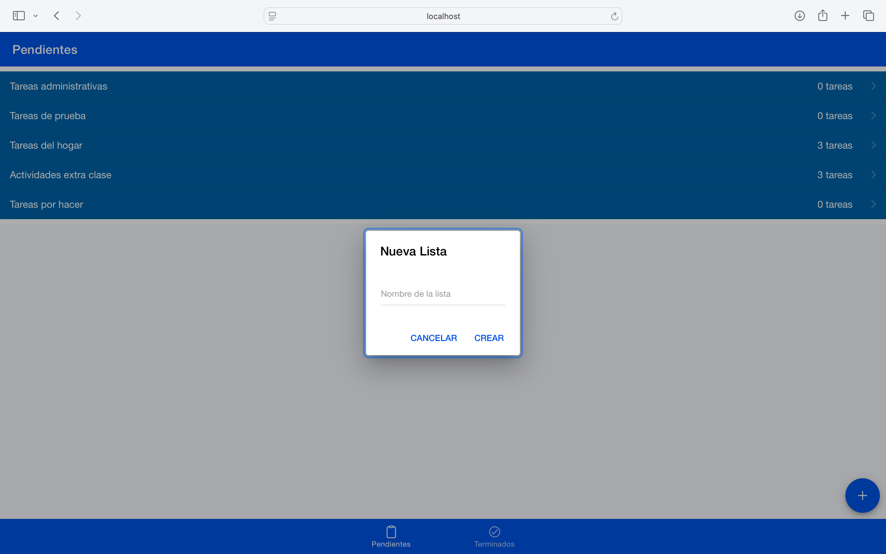
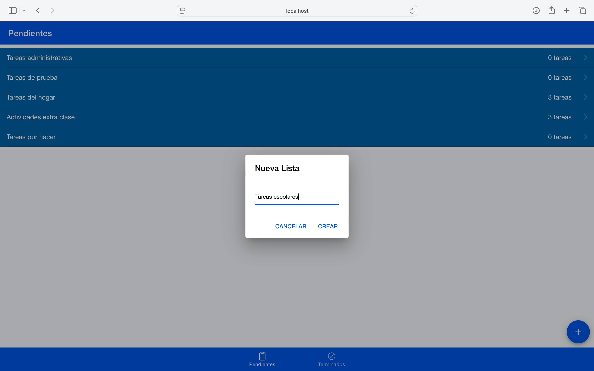
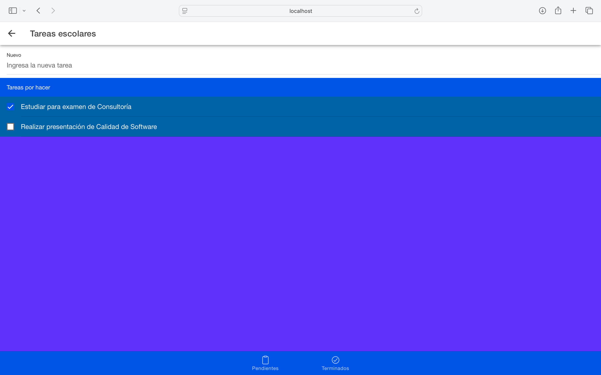

# 📱 Ionic Task Manager

Aplicación móvil desarrollada con **Ionic** y **Angular** para la gestión de tareas y listas de pendientes.

## ✨ Descripción

Este proyecto permite crear y administrar listas de tareas mediante una interfaz intuitiva basada en componentes y navegación por pestañas. Fue desarrollado con el objetivo de fortalecer conocimientos en desarrollo móvil híbrido utilizando Ionic y Angular.

---

## 🚀 Tecnologías utilizadas

- Ionic 8
- Angular
- TypeScript
- HTML5
- CSS3
- Capacitor

---

## 📸 Capturas de Pantalla

### Pantalla principal


### Gestión de tareas


### Listado de tareas


## 📋 Funcionalidades


- Crear listas de tareas
- Agregar tareas a una lista
- Visualizar pendientes
- Navegación mediante Tabs
- Gestión de datos mediante servicios

---

## 📂 Estructura del proyecto

```text
src/
└── app/
    ├── components/
    │   └── listas/
    │       ├── listas.component.ts
    │       ├── listas.component.html
    │       ├── listas.component.scss
    │       └── listas-module.ts
    │
    ├── models/
    │   ├── lista.model.ts
    │   └── lista-item-model.ts
    │
    ├── pages/
    │   └── agregar/
    │       ├── agregar.page.ts
    │       ├── agregar.page.html
    │       ├── agregar.page.scss
    │       ├── agregar.module.ts
    │       └── agregar-routing.module.ts
    │
    ├── servicios/
    │   └── tareas.service.ts
    │
    ├── tab1/
    │   ├── tab1.page.ts
    │   ├── tab1.page.html
    │   ├── tab1.page.scss
    │   ├── tab1.module.ts
    │   └── tab1-routing.module.ts
    │
    ├── tab2/
    │   ├── tab2.page.ts
    │   ├── tab2.page.html
    │   ├── tab2.page.scss
    │   ├── tab2.module.ts
    │   └── tab2-routing.module.ts
    │
    ├── tab3/
    │   ├── tab3.page.ts
    │   ├── tab3.page.html
    │   ├── tab3.page.scss
    │   ├── tab3.module.ts
    │   └── tab3-routing.module.ts
    │
    ├── tabs/
    │   ├── tabs.page.ts
    │   ├── tabs.page.html
    │   ├── tabs.page.scss
    │   ├── tabs.module.ts
    │   └── tabs-routing.module.ts
    │
    ├── app-routing.module.ts
    └── app.module.ts
```

---

## ⚙️ Instalación

### 1. Clonar el repositorio

```bash
git clone https://github.com/marianadehesa/ionic-task-manager.git
```

### 2. Entrar al proyecto

```bash
cd tareas
```

### 3. Instalar dependencias

```bash
npm install
```

### 4. Ejecutar la aplicación

```bash
ionic serve
```

---

## 🎯 Objetivo del proyecto

Aplicar conceptos de:

- Desarrollo móvil híbrido
- Componentes reutilizables
- Servicios en Angular
- Navegación entre páginas
- Organización de aplicaciones Ionic

---

⭐ Proyecto académico desarrollado en clase con Ionic y Angular.